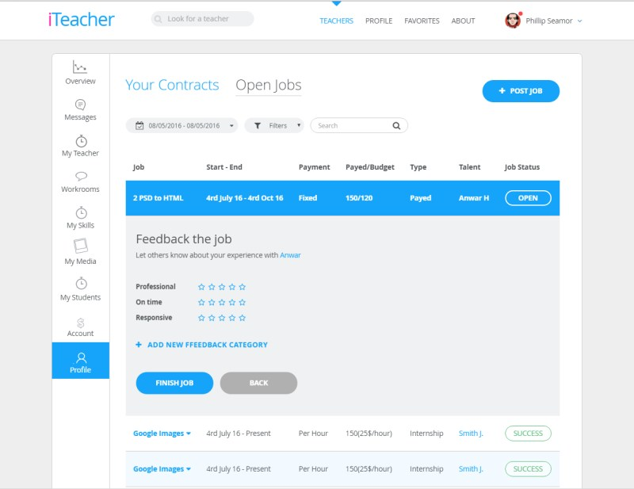

#HTML Template (iTeach)

This is demo version of template.
Demo version show a quality of source code. Project was compiled via GULP extension. 
Demo project made without mobile version!

##Used tools:

1. HTML 5
2. SASS/SCSS - compiled indo minification CSS
3. Bootstrap 3 (grid core only)
4. JS
    * JS: jQuery
    * JS: DateTimePicker
    * JS: Moment
    * JS: Bootstrap 3 (Dropdown JS only)
5. Pixel Perfect check

###GULP Compiled
This project was developed via GULP. "src" - Source folder, with a source files.
####Used features:
1. Minification CSS
2. Minification JS
3. Compressed images

###How to use:
Download "build" folder and run index.html via browser.

###Template of project

###URL:
Page is available by url address:  http://max.iteach.codevery.com/
####Sample of site:



##Examples of code:
###SASS Stylesheet:
The main stylesheet files is "style.css". The file include bootstrap grid, fonts, theme elements, variables.
```sass
    .asideNav
      .aside_list
        margin: 0
        padding: 0
        list-style: none
        a
          &:hover, &.active
            background: $cBlue
            color: $cWhite
            .asideIcon
              @for $i from 1 through  9
                &.ai-#{$i}
                  background-position: 100% (-71.5px * $i)+75px
        .asideIcon
          display: block
          height: 35px
          width: 29px
          margin: 0 auto 3px
          background: url("../images/aside_icons.png") no-repeat 0 0/58px 602px
          @for $i from 1 through  9
            &.ai-#{$i}
              background-position: 0 (-71.5px * $i)+75px
```
###HTML Code:
index.html include "_head.html" and "_footer.html" as a part of template. This parts included by Gulp Rigger.
```html
//= tmpl/_head.html
    //= tmpl/_theHeader.html

    <div class="container">
        <div class="ctWhite ctBordered wrapFlex">
            <div class="asideFlex">
```
Example of pure HTML file:
```html
    <div class="filerTabs">
        <form action="#">
            <div class="filterTabs_wrap">
                <div class="filter_date fieldIcon_wrap">
                    <label  for="filter_tabs_time" class="fieldIcon fa fa-calendar-check-o"></label>
                    <input type="text" name="filter_tabs[time]" id="filter_tabs_time" class="fField fGray fStretch field_date">
                    <i class="fa fa-caret-down caretIcon" aria-hidden="true"></i>
                </div>
                <div class="filter_filter fieldIcon_wrap">
                    <label  for="filter_tabs_filter" class="fieldIcon fa fa-filter"></label>
                    <select name="filter_tabs[filter]" id="filter_tabs_filter" class="fField fGray fStretch field_filte">
                        <option selected disabled>Filters</option>
                        <option value="opt_1">Option 1</option>
                        <option value="opt_2">Option 2</option>
                    </select>
```
